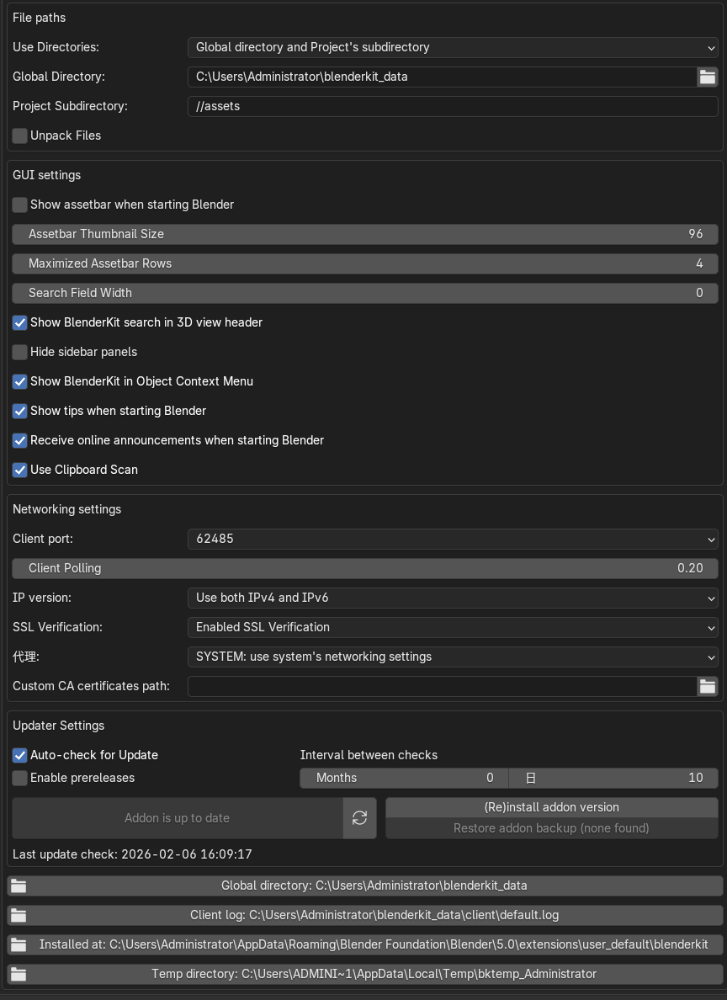

 

这张图里显示的路径确实很多，但其实**你真正需要关心的、也是唯一需要修改的，只有最上面那一个**。

我来为你详细拆解一下红框里这些路径的区别：

### 1. 核心设置区（上面的红框）—— 只需要改这个

这是你要进行配置的地方。

- **Global Directory (全局目录):** `C:\Users\Administrator\blenderkit_data`
  - **这是什么：** 这是**最重要**的设置。你从 BlenderKit 下载的所有模型、材质、HDR 等“资产”，都会永久保存在这个文件夹里。
  - **现状：** 目前默认在你的 C 盘（系统盘）。
  - **建议：** **强烈建议修改这个路径。**
    - C 盘通常空间有限，模型文件多了之后会占用大量空间。
    - 建议在你的 D 盘或 E 盘建一个文件夹（比如 `D:\Blender_Assets`），然后点击这一行右边的文件夹图标，把路径改过去。这样重装系统也不会丢失你下载过的素材。

### 2. 信息展示区（下面的大红框）—— 仅仅是查看，不用改

这部分位于设置面板的最底部，主要是给开发者或遇到报错时用来**查看状态**的，通常**不需要手动修改**，它们只是告诉你当前插件的运行状况。

- **Global directory:**
  - **意思：** 它显示的其实就是你上面设置的那个路径。它是只读的，用来确认系统是否正确识别到了你的设置。
- **Client log:**
  - **意思：** 运行日志。如果插件报错坏掉了，才需要把这个文件发给开发者看。平时不用管。
- **Installed at:**
  - **意思：** 插件本身的安装位置。这是 Blender 的系统文件夹，千万不要动这里的文件，否则插件会消失。
- **Temp directory:**
  - **意思：** 临时文件夹。下载过程中用来暂存碎片文件的地方，电脑重启或清理缓存后可能会自动清空，所以不要把重要东西存这。

------

### 总结：你现在该做什么？

1. **忽略下面的大红框**，那只是信息展示。
2. **只看最上面的 `Global Directory`**。
3. 如果不希望模型占满你的 C 盘，请点击那一行的**文件夹图标** 📂。
4. 导航到你空间较大的硬盘（如 D 盘），新建一个文件夹叫 `BlenderKit_Library`（或者任意你喜欢的名字）。
5. 选中这个新文件夹并确认。

配置好这一个，你的下载环境就非常完美了！