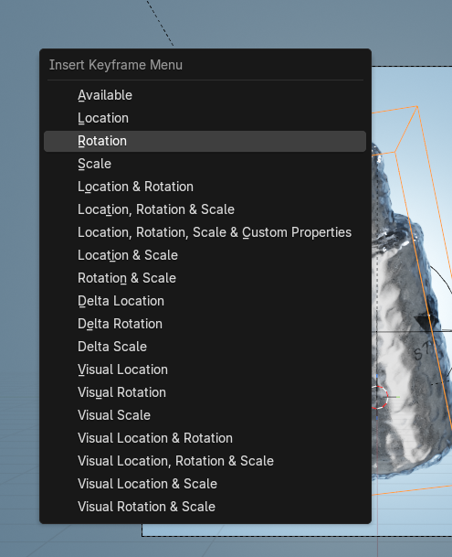

# visual 的这些位移缩放旋转，与普通的有啥不一样的？

 

这是一个非常好的“底层逻辑”问题！这正是从“瞎调参数”进阶到“理解软件逻辑”的关键点。

简单来说：**普通的记录的是“输入值”，而 Visual（视觉）记录的是“最终结果”。**

它们的区别主要体现在**约束（Constraints）**和**父子级关系（Parenting）**上。

### 1. 核心区别：输入 vs 结果

- **普通的 Location/Rotation/Scale（普通插帧）**：
  - **记录的是**：你在右侧属性面板（N面板）里看到的那个数值。
  - **逻辑**：如果你的物体是被“约束”带着跑的（比如它是一个骨骼的子级，或者加了“跟随路径”约束），它的属性面板里的数值可能一直是 `0,0,0`，根本没变。这时候你打普通帧，记录的就是 `0,0,0`。
  - **后果**：如果你把约束删掉，物体就会瞬间弹回原点，因为它自己并没有“移动”，是被别人“拖”着走的。
- **Visual Location/Rotation/Scale（视觉插帧）**：
  - **记录的是**：物体在视图中**肉眼看到的实际位置/角度**。
  - **逻辑**：Blender 会计算所有约束、父级关系叠加后的最终效果，然后把这个最终的空间坐标，**反向写入**到物体的属性面板里。
  - **后果**：打完 Visual 帧后，即使你把约束（Constraints）删掉，物体也会**停留在原地**，因为它已经把那个位置“吃”进自己的坐标数据里了。

------

### 2. 举个最直观的例子（你可以马上试一下）：

假设你有一个方块，给它加了一个 **“Follow Path”（跟随路径）** 约束，让它沿着一个圆圈转。

1. **场景**：你播放动画，方块在转圈。但你看它的 N 面板，位置数据全是 0（或者是锁定的），因为是约束在控制它。
2. **操作 A（普通插帧）**：你在第 10 帧按下 `I` -> `Location`。
   - **结果**：记录了一个 `(0, 0, 0)` 的关键帧。
   - **如果你删掉约束**：方块会直接飞回世界原点。
3. **操作 B（Visual 插帧）**：你在第 10 帧按下 `I` -> `Visual Location`。
   - **结果**：Blender 会看一眼方块现在在哪（比如在 `x:5, y:2, z:0`），然后把这个数值强制写入关键帧。
   - **如果你删掉约束**：方块会**定在** `(5, 2, 0)` 这个位置不动，因为它已经“学会”了这个位置。

------

### 3. 什么时候用 Visual（视觉）插帧？

作为一个美妆/产品动画师，你会在以下“骚操作”中用到它：

1. **“过河拆桥” / 烘焙动画（Baking）**：
   - 当你用复杂的物理模拟或者约束做好了一个动画（比如盖子沿着螺纹旋开），你想把它发给别人，或者导出到其他软件（如UE5、Unity）。带约束的模型经常会出错。
   - **做法**：对每一帧都打 **Visual Keyframe**，然后删掉所有约束。这样你的模型就变成了纯粹的位移数据，谁都能打开，怎么动都不会坏。
2. **动态切换（Space Switching）**：
   - 比如一个粉底液瓶子，前3秒是放在桌子上的（由桌子控制），第4秒被人手拿起来了（由手控制）。
   - 在切换的那一瞬间，为了保证瓶子不乱飞，通常需要用 Visual Keyframe 来“对齐”位置，确保从“桌子空间”切换到“手空间”时，视觉上是无缝衔接的。
3. **循环动画修复**：
   - 有时候做循环动画，首尾位置稍微差了一点点。用 Visual Keyframe 可以强制把某一帧定死在视觉位置上，防止漂移。

### 总结给你的“笔记”：

- **普通插帧** = 记录**“参数值”**（不管实际上物体在哪，只管面板上的数）。
- **Visual 插帧** = 记录**“所见即所得”**（不管是谁在控制物体，把它现在的实际位置给记死）。

**对于 90% 的日常关键帧动画（Keyframing），用普通的就够了。** 只有当你涉及到“约束转换”或者“导出资产”时，才需要用到 Visual。