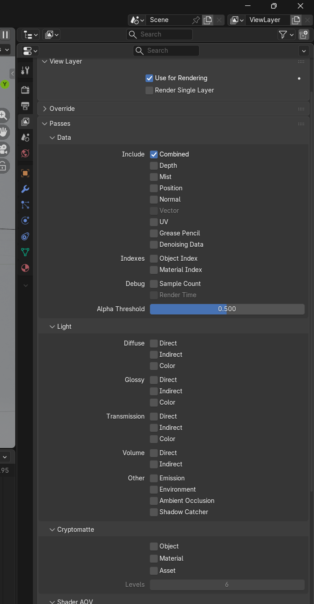

# OptiX 与OpenImageDenoise 

这两个选项都是 Blender Cycles 渲染器中用于**降噪（Denoising）\**的 AI 算法，它们的核心目的都是去除渲染过程中的噪点，但\**底层逻辑**和**适用场景**有很大区别。

简单总结：**OptiX 是“速度派”（NVIDIA 独占），OIDN 是“质量派”（通用且稳定）。**

以下是详细的技术对比和使用建议：

## 1. 核心区别对比表

| **特性**     | **OptiX**                                                    | **OpenImageDenoise (OIDN)**                                  |
| ------------ | ------------------------------------------------------------ | ------------------------------------------------------------ |
| **开发者**   | **NVIDIA**                                                   | **Intel** (开源)                                             |
| **硬件要求** | **仅限 NVIDIA 显卡**（需要支持 CUDA 的 GPU，RTX 系列效果最佳） | **全平台**（CPU 都能跑；新版 Blender 也支持 N卡/A卡/Apple Silicon 的 GPU 加速） |
| **底层原理** | 利用 NVIDIA 显卡上的 **Tensor Cores (张量核心)** 进行硬件级 AI 加速。 | 利用 CPU 的指令集（如 AVX2/AVX-512）或通用 GPU 计算进行 AI 降噪。 |
| **速度**     | **极快**（几乎实时）                                         | 较快（但在 GPU 介入前比 OptiX 慢）                           |
| **质量**     | 优秀，但在极低采样率下可能会丢失少量纹理细节。               | **最顶级**，对细节的保留通常比 OptiX 更精准，画面更干净。    |
| **主要用途** | **视图预览 (Viewport)**                                      | **最终渲染 (Final Render)**                                  |

## 2. 技术逻辑解析 (Why & How)

你之前的图片提示中也提到了“GPU 加速”和“Intel”，这背后的逻辑是：

- **OptiX (NVIDIA):**

  它是“硬解”思路。NVIDIA 在 RTX 显卡里埋了专门处理 AI 运算的电路（Tensor Cores）。选 OptiX 时，Blender 直接把降噪任务丢给这部分电路。因为是专路专用，所以它快到可以跟上你旋转视图的速度，让你在预览时几乎瞬间看到无噪点的图。

- **OpenImageDenoise (OIDN):**

  它是“软解/通用”思路（虽然现在也支持 GPU 加速）。Intel 训练这个 AI 模型是为了追求“准确性”。它在处理复杂的几何边缘、阴影过渡时，通常比 OptiX 更不容易产生“涂抹感”或“伪影”。它更像是一个慢工出细活的专家。

## 3. 如何选择？

基于目前的 Blender 工作流，推荐的策略是：

- **视图采样 (Viewport) -> 选 OptiX**
  - **理由：** 你在编辑、打光、旋转模型时，需要即时反馈。OptiX 的毫秒级响应能让你流畅地看到大概效果，而不需要等待。
  - **设置位置：** 渲染属性面板 -> Sampling -> Viewport -> Denoise。
- **最终渲染 (Render) -> 选 OpenImageDenoise (OIDN)**
  - **理由：** 最终出图时（F12），你不差那几秒钟的渲染时间，质量是第一位的。OIDN 在处理最终图像时通常更稳，不容易出现闪烁（如果是做动画）或细节丢失。
  - **设置位置：** 渲染属性面板 -> Sampling -> Render -> Denoise。

**总结建议：** 如果你的电脑有 NVIDIA 显卡（如 RTX 系列），平时预览开 **OptiX** 爽快操作，最后出图用 **OIDN** 保证画质。

# 要用 exr的16位还是32位？

结论非常明确：**请毫不犹豫地选择 16 位 (Float Half)。**

对于你目前的阶段（产品动画、电商视频、达芬奇调色），**32 位是完全没有必要的“资源浪费”**。

以下是 **3 个硬核理由**，帮你彻底拔草 32 位：

### 1. 人眼根本看不出区别

- **16 位 (Half Float)**：它能记录 **30 档以上的动态范围**。
  - 哪怕是阿凡达那种级别的电影，其核心的画面合成（Beauty Pass）通常也只用 16 位 EXR。
  - 它可以轻松记录比太阳还亮的光，怎么拉曲线都不会断层。
- **32 位 (Full Float)**：它是给**科学计算**用的。
  - 除非你要计算原子弹爆炸的精确物理数据，或者在一个极其巨大的场景里（比如从地球飞到火星）做精确的距离合成，否则它对于“颜色”来说是极度过剩的。

### 2. 硬盘会“爆炸”

这是最现实的问题。EXR 本来就大，32 位更是恐怖：

- **16 位 EXR**：一张图可能是 **20MB**。
- **32 位 EXR**：一张图就是 **40MB - 50MB**。
- **结果**：你做一个 10 秒的动画，32 位会多占你 **好几个 G** 的空间，而且没有任何画质提升。

### 3. 达芬奇会“卡顿”

你的达芬奇在回放视频时，需要从硬盘里读取数据。

- 读取 32 位的数据量是 16 位的**两倍**。
- 这意味着你的**时间线回放会变卡**，剪辑体验会变差。

------

### ⚠️ 唯一的“例外”（进阶知识）

只有一种情况你需要开 32 位，那就是**“数据通道”**。

如果你在 Blender 里开启了 **Z 通道 (Z-Depth)** 用来在后期做“景深模糊”，或者 **Position (位置)** 通道用来做特效：

- **Z 通道**：有时候在 16 位下会有轻微的条纹（特别是场景非常深的时候）。
- **建议**：即便如此，对于产品动画（比如一个易拉罐），16 位通常也足够了。

### ✅ Blender 正确设置作业

请检查你的 **输出属性 (Output Properties)**：

1. **文件格式**：OpenEXR
2. **颜色深度 (Color Depth)**：选 **Float (Half)** <-- **这就是 16 位**
3. **编码 (Codec)**：选 **ZIP (无损)** 或 **DWAA (有损压缩但极小)**
   - *推荐 DWAA，肉眼看不出区别，文件体积能缩小 50% 以上！*

**一句话总结：选 Float (Half)，既省硬盘又流畅，画质还是好莱坞级别的！**

# Z 通道 (Z-Depth) 用来在后期做“景深模糊”，这种场景应该很少有场景用到吧。

恰恰相反！**Z 通道（Z-Depth）是商业项目中“救命”的神器，也是职业剪辑师和特效师最常用的通道之一。**

虽然对于你的“个人练习”来说，你可能觉得直接在 Blender 里渲染好景深（DoF）就行了。但在真实的商业流程里，**Z 通道的使用频率极高**，原因主要有两点：**“省钱”** 和 **“后悔药”**。

不过，针对你明天要做的**“瓶瓶罐罐”**（玻璃/液体），它有一个**致命的缺陷**，你必须知道。

### 1. 为什么它是“省钱”神器？（渲染时间）

在 Blender Cycles 里开启真实的“相机景深”（让背景虚化）：

- **代价**：渲染时间会成倍增加！因为渲染器需要计算大量的光线散射来模拟模糊，噪点也会变多。
- **Z 通道做法**：
  - 你在 Blender 里渲染一张**全清晰**的图（渲染快，噪点少）。
  - Z 通道是**“免费”**赠送的（不增加任何渲染时间）。
  - 你去达芬奇里，挂一个“Depth Blur”特效，**1 秒钟**就能算出虚化效果。

### 2. 为什么它是“后悔药”？（甲方需求）

想象一下，你花 10 小时渲染了一个易拉罐动画，背景是虚化的。

**甲方/客户说**：“哎呀，背景里那个 Logo 太糊了，给我弄清楚一点。”

- **如果你是 Blender 直出景深**：完蛋。你需要重调相机，**重新渲染 10 小时**。
- **如果你有 Z 通道**：
  - 你在达芬奇里，调整一下“对焦距离”的滑杆。
  - **1 秒钟搞定**。背景变清晰了，或者你可以把焦点从易拉罐移到背景上（做“变焦”效果）。
  - **不用重新渲染！**

### 3. Z 通道还能干什么？（不仅仅是模糊）

除了景深，Z 通道最常用的场景其实是**“造雾”**：

- **空气透视**：你想让远处的物体看起来“淡”一点（像有大气雾霾）。
- **达芬奇操作**：利用 Z 通道，只把“距离 > 5米”的地方压亮、降低饱和度。瞬间就有了大片感。

------

### ⚠️ 高能预警：明天做“玻璃”千万别信 Z 通道！

既然你明天要做**瓶瓶罐罐（透明物体）**，这点至关重要：

**Z 通道对“玻璃”是无效的！**

- **原理**：Z 通道记录的是“光线碰到的第一个物体的距离”。
- **Bug**：当你透过玻璃瓶看后面的背景时，Z 通道记录的是**玻璃瓶表面的距离**，而不是**玻璃后面背景的距离**。
- **后果**：如果你用 Z 通道做后期虚化，玻璃瓶里的背景会变得**异常清晰**（或者边缘有极其难看的锯齿），完全不符合物理规律。

### ✅ 给你的建议

1. **对于明天的“玻璃/液体”练习**：
   - **不要用后期景深**。
   - 直接在 Blender 相机里开启 **景深 (Depth of Field)**。
   - 虽然渲染慢点，但光线折射和虚化是最真实的。
2. **对于不透明物体（比如易拉罐、手机）**：
   - 养成输出 Z 通道（勾选 `Z` 或 `Depth`）的好习惯。
   - 即使你现在不用，万一将来想加个雾、改个虚化，它就是你的救命稻草。

**总结：**

Z 通道在大片里几乎是标配，但在**透明材质**面前是“废”的。明天做玻璃，老老实实在这 Blender 里开光圈渲染吧！

# 32位z通道，如何勾选或者取消？

这是一个非常棒的实操问题！

在 Blender 里，**“Z 通道”的开关** 和 **“32位精度”的设置** 其实是分在两个不同地方控制的。

为了防止你找晕，我把它们拆解成两步：

### 第一步：在哪里“勾选” Z 通道？（开关）

这是告诉 Blender：“渲染的时候，顺便帮我把距离信息也算出来。”

1. 在右侧属性面板，点击那个 **像一叠照片一样的图标**（**View Layer Properties / 视图层属性**）。
2. 找到 **Passes (通道)** -> **Data (数据)** 这一栏。
3. 勾选第一个 **Z**。

- **勾选了它**：你的多层 EXR 文件里就会多一层叫 `Depth.Z` 的数据。
- **取消勾选**：EXR 里就只有画面，没有深度信息。

------

### 第二步：如何让它变成“32位”？（精度）

这是告诉 Blender：“把这个 Z 通道存得非常精确（32位），还是普通精确（16位）？”

这里有一个**反直觉**的设定：

Blender 的标准界面里，**没有**单独给 Z 通道设 32 位的开关。它**跟随**整个文件的设置。

你需要回到 **Output Properties (输出属性)**（那个打印机图标）：

- **如果你选了 Float (Half)**：整个文件（包括 Z 通道）都是 **16 位**。
  - *优点*：文件小（20MB）。
  - *缺点*：如果场景极其巨大（比如几公里的风景），Z 通道可能会有轻微条纹。
- **如果你选了 Float (Full)**：整个文件（包括 Z 通道）都是 **32 位**。
  - *优点*：Z 通道精度极高，也就是传说中的“真·32位 Z 通道”。
  - *缺点*：文件巨大（50MB+），你的硬盘会哭。

### 💡 给你明天的“易拉罐”建议

**不用纠结，保持 16 位 (Float Half) 即可！**

理由如下：

1. **场景小**：你的易拉罐场景也就几十厘米大，**16 位的 Z 通道精度绰绰有余**，绝对不会出现条纹。
2. **不值得**：为了一个 Z 通道把整个文件体积翻倍，对于这个项目来说是巨大的浪费。
3. **操作**：
   - **去“视图层属性”把 `Z` 勾上**（以此养成好习惯）。
   - **输出设置保持 `Float (Half)` 不动**。

这样你就得到了一个“够用”的 Z 通道，既有了后期调整的空间，又没撑爆硬盘。

# 这些都是什么意思？都能勾选存放到exr文件里吗？没有z通道啊，是depth吗？

 

这就是达芬奇和 Nuke 这种后期合成软件最喜欢的地方。你看到的这每一个勾选框，勾选后都会变成 EXR 千层饼里的一层“肉馅”。

针对你的三个问题，我来逐一解答：

### 1. 没有 Z 通道啊，是 Depth 吗？

**是的，完全正确！**

- **Blender 里的名字**：叫 **`Depth`** (深度)。
- **行业通用的名字**：叫 **`Z-Depth`** 或简称 **`Z`**。
- **达芬奇里的名字**：进去后它通常会被自动识别为 **`Z`** 通道。

所以，**勾选 `Depth` = 你就有了 Z 通道。**

------

### 2. 都能勾选存放到 EXR 文件里吗？

**理论上：是的，全都可以存进去。**

只要你把这里的勾都打上，导出的那一张 `.exr` 文件里就会包含几十层数据。

**实际上：千万别全选！**

- 如果你全选，单帧文件大小可能会从 **20MB 暴涨到 500MB**。
- 而且 90% 的通道你根本用不上。

------

### 3. 这些都是什么意思？（只讲你明天做瓶子能用上的）

为了防止你晕，我把它们分为 **“必选神器”**、**“高级省钱”** 和 **“暂时别碰”** 三类。

#### ✅ 第一类：必选神器（明天作业建议勾选）

1. **`Combined` (合并)**：
   - 这就是你渲染出来的最终画面（美图）。**默认必须有**。
2. **`Depth` (深度)**：
   - 也就是 Z 通道。虽然玻璃对它有 Bug，但养成勾选它的习惯没错。
3. **`Cryptomatte` (加密蒙版) -> 勾选 `Object` (物体) 和 `Material` (材质)**：
   - **这是最重要的！** 它的作用是让你在达芬奇里，用吸管点一下“瓶盖”，就能把瓶盖单独抠出来调色。
   - *注意：需要在达芬奇安装 Reactor 里的 Cryptomatte 插件或者使用较新版达芬奇原生功能。*

#### 🚀 第二类：高级省钱（懂了之后能大幅减少渲染时间）

1. **`Vector` (矢量/运动矢量)**：
   - **省时间神器**。如果你不想在 Blender 里渲染真实的运动模糊（因为太慢了），你可以勾选这个。
   - 它记录了物体移动的速度和方向。
   - 在达芬奇里加上 `Vector Motion Blur` 特效，一秒钟就能算出运动模糊，不用 Blender 慢慢算。
2. **`Mist` (迷雾)**：
   - 它是 Z 通道的“抗锯齿版”。如果你做带雾气的场景，用 Mist 往往比用 Depth 更顺滑。
3. **`Denoising Data` (降噪数据)**：
   - 只有当你打算**在后期软件里进行降噪**，或者你在 Blender 的合成器里自己连 `Denoise` 节点时才需要。一般如果你在渲染设置里直接开了 OpenImageDenoise，这个就不需要存了。

#### ❌ 第三类：暂时别碰（光照分层）

看你截图中间那一大堆 **`Light` (光照)** 下面的选项：

- `Diffuse` (漫射)
- `Glossy` (光泽)
- `Transmission` (透射/玻璃)
- ...以及它们的 `Direct` (直接光) 和 `Indirect` (间接光)。

**这些是干嘛的？**

它们是把你的画面“拆散”了。

```
Combined (最终画面) = Diffuse + Glossy + Transmission ...
```

**为什么建议你别勾？**

除非你是要做**极其精细的电影级合成**（比如觉得玻璃反光太强，想单独把反光这一层减弱 50%，但不动玻璃本身的颜色），否则**千万别勾**。

- 它们会极大地增加文件体积。
- 对于产品动画，用 Cryptomatte (选区调色) 通常就足够解决问题了。

------

### 📝 明天的“瓶瓶罐罐”设置作业

为了既保证后期空间，又不撑爆硬盘，建议明天的设置如下：

1. **Data (数据)** 栏：
   - [x] **Combined** (默认)
   - [x] **Depth** (Z通道)
   - [ ] Vector (除非你想后期加模糊，否则不勾)
   - 其他都不勾。
2. **Cryptomatte (加密蒙版)** 栏：
   - [x] **Object** (方便后期单独调某个瓶子)
   - [x] **Material** (方便后期单独调某种标签或液体的颜色)
3. **Light (光照)** 栏：
   - **全部不勾**。

这样导出的 EXR，既轻便又强大！

# depth的16位，也是可以做景深模糊的吧。	

**完全可以！对于你的“瓶瓶罐罐”项目来说，16 位 (Half Float) 的 Z 通道是绰绰有余的。**

放心大胆地用 16 位，根本不需要开 32 位。

为了让你更安心，我给你拆解一下这背后的逻辑：

### 1. 为什么 16 位足够了？

- **不仅仅是整数**：EXR 的 16 位是 **浮点数 (Float)**，而不是普通的整数。这意味着它在存储数据时，精度是动态调整的。
- **对于近距离物体（你的情况）**：在产品动画这种几米范围内的场景里，16 位浮点数的精度极高，可以精确到**微米级**。
- **结果**：你做出来的景深模糊会非常丝滑，绝对不会出现“阶梯状”的断层（Banding）。

### 2. 什么时候才需要 32 位？

只有一种极端情况需要 32 位 Z 通道：**超大尺度的宇宙或风景镜头。**

- 比如你的镜头是从地面一直拉到几公里外的山上。
- 在这种跨度极大的情况下，16 位在远处的精度会下降，可能会导致远山的模糊边缘出现锯齿。
- 但你的易拉罐也就几十厘米，**16 位对你来说已经是“杀鸡用牛刀”了，非常稳。**

### 3. 一个真正需要注意的“坑” (比位深更重要)

做景深模糊时，**8 位 (如 PNG)** 才是绝对不能用的。

- **8 位 Z 通道**：只有 256 个距离层级。做模糊时，背景会像纸片一样一层一层的，非常假。
- **16 位 Z 通道**：有成千上万个层级。

**结论：**

保持你的设置：**OpenEXR + Float (Half)**。

这既保证了完美的模糊质量，又帮你省下了一半的硬盘空间。你的选择是非常专业的！

# 编码方式，会影响渲染速度吗？

这是一个非常好的“性能优化”问题。

**简短回答：**

**几乎不影响。**

你完全不需要为了“渲染更快”去纠结编码方式。

详细来说，渲染过程分为两个阶段，编码只影响最后那个瞬间：

### 1. 阶段一：计算 (Rendering) —— **耗时 99%**

- **这是什么？** 你的显卡 (GPU) 拼命计算光线、折射、阴影的过程。
- **受影响吗？** **完全不受影响。**
  - 不管你选 ZIP 还是 DWAA，显卡算出这张图的时间是一模一样的。该算 5 分钟还是 5 分钟。

### 2. 阶段二：写入硬盘 (Saving) —— **耗时 1%**

- **这是什么？** 显卡算完后，CPU 把这张图“打包压缩”并写进你的硬盘里。
- **受影响吗？** **是的，这里会有区别。**
  - **无压缩 (None)**：CPU 不干活，直接写。速度最快，但文件巨大（硬盘读写慢的话反而会卡）。
  - **ZIP (无损压缩)**：CPU 稍微干点活，把文件压小一点再写。
  - **DWAA (有损压缩)**：CPU 多干点活，把文件压得非常小再写。

### 💡 实际案例对比

假设你渲染一帧易拉罐画面，显卡计算需要 **60秒**。

- **选 ZIP**：计算 60秒 + 打包写入 0.5秒 = **60.5秒**
- **选 DWAA**：计算 60秒 + 打包写入 0.8秒 = **60.8秒**

**结论：**

那 0.3 秒的区别，在你喝口水的时间里就被忽略不计了。

------

### ⚠️ 但是！它会严重影响“后期剪辑速度”

虽然它不影响 Blender 渲染，但它**严重影响 DaVinci Resolve 的回放速度**：

1. **ZIP / PIZ (文件大)**：
   - 一帧 EXR 可能有 **50MB**。
   - 达芬奇播放一秒（24帧）需要从硬盘读取 **1200MB** 的数据。
   - 如果你的机械硬盘读写速度只有 100MB/s，**视频就会卡顿，播不动。**
2. **DWAA (文件小 - 强烈推荐)**：
   - 一帧 EXR 可能只有 **5MB**。
   - 达芬奇播放一秒只需要读取 **120MB**。
   - **剪辑非常流畅，随拉随停。**

### ✅ 最终建议

**为了你的硬盘空间和剪辑流畅度，请锁死这个设置：**

- **编码 (Codec)**: 选择 **`DWAA`** (DreamWorks AA)

  - *理由*：它是目前性价比最高的编码。文件体积极其小（比 ZIP 小 5-10 倍），画质肉眼几乎看不出损失，渲染速度也没影响。
  - *注意*：如果你的 Blender 版本较旧找不到 DWAA，就用 **ZIP**。千万别选“无 (None)”，那样你的硬盘瞬间就会满。


# 预览和成片的渲染

**在 3D 渲染领域，"把所有能勾的都勾上，参数调到最大" 通常意味着：你的渲染时间增加了 10 倍，但画质只提升了 1%（甚至可能因为噪点变多而画质下降）。**

为了帮你节省电费和显卡寿命，你需要理解**“边际效应递减”**。

针对你的 **RTX 5060 Ti** 和 **美妆流体视频**，我给你一套**“样片 vs 成片”**的科学参数策略：

------

### 1. 样片/预览参数 (Preview) —— 求快

*目标：1-3秒出一张，只看大概的光影和材质颜色。*

- **采样 (Samples)**: `32` 或 `64`
- **降噪 (Denoise)**: **必须开** (OpenImageDenoise / OptiX)
- **光程 (Light Paths)**: Total `4` (玻璃会变黑，但这只是为了看动画流畅度)
- **分辨率 (Resolution)**: `50%` (即 1920x1080 变成 960x540)

------

### 2. 成片/最终输出参数 (Final) —— 求稳

*目标：画质细腻，没有闪烁，但速度要在合理范围内（比如 30秒-1分钟/帧）。*

#### A. 采样数：千万别用默认的 4096！

- **误区**：以为 4096 甚至 8192 才是高清。
- **真相**：有了现在的 AI 降噪技术，**`512` 到 `1024`** 就已经是商业成片的标准了。
- **建议**：设置 **Threshold (阈值)** 为 `0.01`，**Max Samples** 设为 **`1024`**。
  - *超过 1024 后，你肉眼几乎看不出区别，但时间是线性的增加。*

#### B. 光程 (Bounces)：够用就行，多了浪费

- **误区**：以为反弹次数 (Bounces) 越高，玻璃越通透。
- **真相**：光线弹射 12 次之后，对画面的贡献几乎为零（除非你在渲染复杂的钻石内部）。
- **建议**：
  - **Total (总数)**: `12`
  - **Transmission (透射/玻璃)**: `12` (这个对你很重要)
  - **Glossy (光泽)**: `8`
  - **Diffuse (漫射)**: `4`
  - *千万不要手滑拉到 32 或 128，那样会让你的渲染无限慢。*

#### C. 焦散 (Caustics)：最危险的开关

- **误区**：“把能选的都选上”，所以去勾选 `Refractive Caustics`。
- **后果**：你的画面里会出现无数个**“消不掉的白点” (Fireflies)**。
- **建议**：除非你有特殊的特写镜头需要展示“光透过玻璃聚成的一个亮点”，否则**做视频时通常是关闭焦散的**。如果非要开，必须配合“Light Tree”等高级优化，否则就是灾难。

------

### 💡 真正决定画质的“关键参数” (你应该关注这些)

如果你真的想提升成片的质量，与其无脑加采样，不如关注这两个：

1. **分辨率 (Resolution)**：
   - 把 `1080p` 提升到 `4K (3840x2160)`。
   - 这才是实打实的画质提升。4K 下即便采样低一点，噪点也会因为像素变小而显得细腻。
2. **动态模糊 (Motion Blur)**：
   - **做视频必开！**
   - 在 Render Properties -> 勾选 **Motion Blur**。
   - 这会让你的流体运动看起来丝般顺滑，而不是一卡一卡的。虽然会增加一点点渲染时间，但**质感提升巨大**。

### 总结

**不要**等到最后把所有参数都拉高。

你现在的策略应该是：**找到一个“正好没有噪点”的最低值。**

**我的建议配置（直接抄作业）：**

- **分辨率**: 1920x1080 (2K) 或 3840x2160 (4K)
- **引擎**: Cycles (GPU)
- **采样**: **512** (如果觉得脏就加到 1024，别再高了)
- **降噪**: OpenImageDenoise (Albedo + Normal)
- **光程**: Total 12 / Transmission 12
- **动态模糊**: **ON**

这就足够输出像苹果广告一样级别的画面了。不需要 4096！